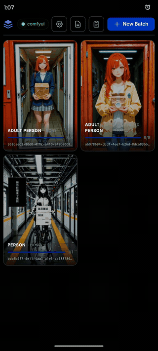
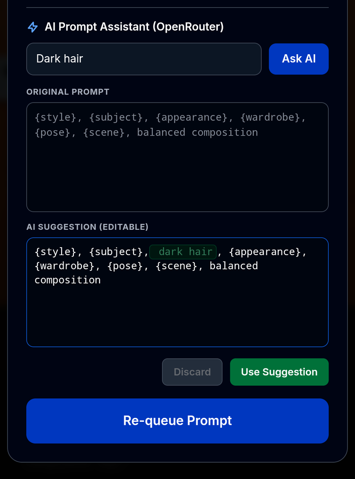

# SceneQueue

<p align="center">
  
</p>

<p align="center">
  <em>Generated with the included <code>manga_demo</code> preset.</em>
</p>

SceneQueue turns large ComfyUI prompt batches into editable visual storyboards.
Instead of maintaining a long JSON file, generate the whole sequence once and
continue working directly from its gallery: edit any frame's prompt, compare the
revision, re-queue it, or insert new frames before or after it without rebuilding
the batch by hand.

Its optional AI assistant can use the surrounding prompts as narrative context
to create up to five preceding, continuation, or transition frames. Every inserted
prompt remains visible and editable, so the sequence grows under your control
rather than becoming an opaque one-shot generation.

[](https://github.com/al4xdev/scenequeue/actions/workflows/test.yml)
[](https://github.com/al4xdev/scenequeue/pkgs/container/scenequeue)

The repository ships with general-purpose, safe-for-work examples and a workflow
made only from standard ComfyUI nodes. Your prompts, generated images, selected
models, and local workflow edits live under `.data/` and are never committed.

## See it in action

<table>
  <tr>
    <td width="50%" align="center">
      
    </td>
    <td width="50%" align="center">
      
    </td>
  </tr>
  <tr>
    <td align="center">
      <strong>Mobile-first workflow</strong><br>
      Browse sessions, inspect generated frames, adjust generation settings, and
      manage prompt databases with touch-friendly controls.
    </td>
    <td align="center">
      <strong>AI-generated continuations</strong><br>
      Use <em>AI Insert After</em> to describe what happens next, generate multiple
      prompt segments, and queue the new sequence immediately.
    </td>
  </tr>
</table>

<p align="center">
  
</p>

<p align="center">
  <strong>Review before applying.</strong><br>
  AI suggestions remain editable, and inserted text is highlighted before the
  updated prompt is accepted and re-queued.
</p>

## Features

- Edit a generated batch directly from its visual gallery instead of maintaining
  a large prompt JSON file.
- Insert and generate frames before or after any existing image.
- Prompt revision history with visual diffs, editable AI suggestions, and re-queue.
- Context-aware AI generation of up to five preceding or continuation frames.
- Ordered prompt databases with insert, edit, history, and retry operations.
- Reusable placeholders for subject, appearance, wardrobe, pose, scene, and style.
- Sequential batch generation with configurable resolution, checkpoint, and LoRAs.
- Advanced sampler, scheduler, denoise, CFG, and optional high-resolution pass controls.
- Optional adult-content mode; general-audience negative tags are enabled by default.
- ComfyUI queue monitoring over WebSocket with HTTP fallback.
- Session gallery, thumbnails, failed-slot recovery, and optional upscaling.
- Optional OpenRouter assistant for prompt editing and transition-frame generation.
- Installable PWA frontend with no JavaScript build step.

## Requirements

- Python 3.11 or newer.
- [`uv`](https://docs.astral.sh/uv/).
- A running ComfyUI instance reachable from this machine.

The default generation workflow uses these standard nodes:
`CheckpointLoaderSimple`, `CLIPTextEncode`, `EmptyLatentImage`, `KSampler`,
`LatentUpscale`, `VAEDecode`, and `SaveImage`. Selected LoRAs are injected with
standard `LoraLoader` nodes at queue time.

## Quickstart

```bash
git clone https://github.com/al4xdev/scenequeue.git
cd scenequeue
./install.sh
./start.sh
```

Open <http://127.0.0.1:8889>, then use Settings to configure:

- the ComfyUI URL;
- the local ComfyUI root directory;
- a checkpoint;
- the prompt node ID and input key if you replace the bundled workflow;
- generation resolution, checkpoint, and optional LoRAs.
- sampler and scheduler parameters;
- an optional high-resolution second pass;
- the general-audience/adult-content switch.

The **Fast Illustration Sampling** button applies a model-independent starting
point: 12 base steps with the `beta57` scheduler and a four-step high-resolution
refinement. It preserves the checkpoint and LoRAs currently selected by the user.

The first run copies source defaults into `.data/`. Editing prompt databases or
workflows through the application never changes the files committed in `defaults/`.

## Included manga demo

Select the `manga_demo` database in each prompt category to queue an eight-frame
story called **The Last Delivery** with its intended courier, wardrobe, station,
and manga style. The sequence demonstrates:

- stable subject, wardrobe, prop, and location continuity;
- establishing, reaction, reveal, action, and closing shots;
- deliberate pacing across a complete visual micro-story;
- reusable placeholders, so the same sequence can feature a person, robot, fox,
  or any subject added by the user.

## Docker

The latest multi-architecture image is published automatically to GitHub
Container Registry for `linux/amd64` and `linux/arm64`.

### Docker Compose

```bash
docker compose up -d
```

Open <http://localhost:8889>. In Settings, use
`http://host.docker.internal:8188` as the ComfyUI URL when ComfyUI runs directly
on the host. Change the port if your ComfyUI instance uses a different one.

The named `scenequeue-data` volume preserves configuration, prompt databases,
workflows, API credentials, and gallery state across container upgrades.

To update:

```bash
docker compose pull
docker compose up -d
```

### Docker CLI

```bash
docker pull ghcr.io/al4xdev/scenequeue:latest
docker volume create scenequeue-data
docker run -d \
  --name scenequeue \
  --restart unless-stopped \
  -p 8889:8889 \
  --add-host host.docker.internal:host-gateway \
  -v scenequeue-data:/app/.data \
  ghcr.io/al4xdev/scenequeue:latest
```

On Linux, host networking is also available:

```bash
docker run -d \
  --name scenequeue \
  --restart unless-stopped \
  --network host \
  -v scenequeue-data:/app/.data \
  ghcr.io/al4xdev/scenequeue:latest
```

With host networking, use the normal loopback ComfyUI URL, such as
`http://127.0.0.1:8188`.

### Build locally

```bash
docker build -t scenequeue .
docker run --rm -p 8889:8889 -v scenequeue-data:/app/.data scenequeue
```

## Custom workflows

Export a workflow in ComfyUI's API format and replace:

- `.data/workflows/workflow_api.json` for generation;
- `.data/workflows/upscale_api.json` for upscaling.

Set `target_node_id` and `target_input_key` in Settings to the node/input that
receives the positive prompt. Checkpoint and LoRA injection is discovered by node
class, so users normally only need to choose another model in the interface.

The bundled upscale workflow expects `RealESRGAN_x4plus.pth`. Change its
`UpscaleModelLoader` value if that model is not installed.

## Optional OpenRouter assistant

Create `.data/.env`:

```env
OPENROUTER_API_KEY=your-key
OPENROUTER_MODELS=deepseek/deepseek-chat,meta-llama/llama-3.3-70b-instruct
```

The API key remains server-side and is never returned by the settings endpoint.
Without it, every non-AI editing and generation feature remains available.
You can also configure or remove the key in Settings → OpenRouter Assistant; the
password field is write-only and displays only whether a key is configured.

## Data layout

```text
.data/
├── config.json
├── databases/
├── gallery/
└── workflows/
```

Set `SCENEQUEUE_DATA_DIR` to store runtime data elsewhere. Set
`SCENEQUEUE_HOST` and `SCENEQUEUE_PORT` to change the default
`127.0.0.1:8889` listener.

This application has no authentication layer. Keep it bound to localhost or a
trusted private network.

## Development

```bash
uv sync --dev
uv run ruff check .
uv run pytest
```

GitHub Actions runs the same lint and test checks without requiring a live ComfyUI
server or OpenRouter account.

## License

MIT
